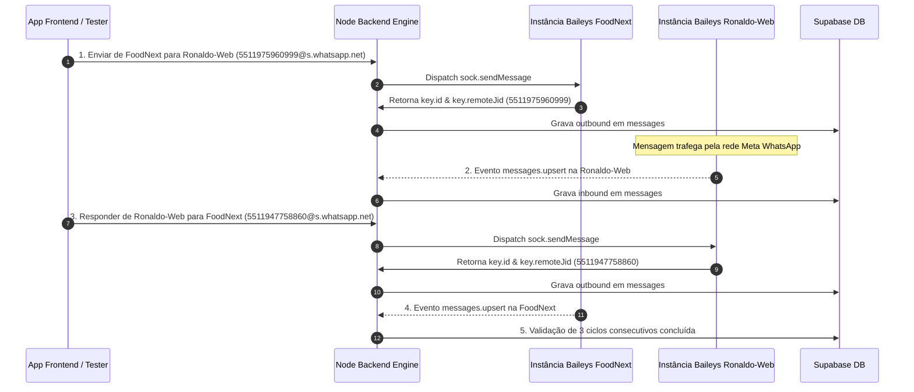

# Skill: Protocolo de Testes Bidirecionais Baileys E2E (FoodNext ↔ Ronaldo-Web)

> ⚡ **GATILHO DE ATIVAÇÃO**: Digite `teste envios` (ou `teste envios.`) no chat para executar este protocolo de testes E2E automaticamente.

Esta skill estabelece a metodologia de teste contínuo e validação de socket em tempo real entre as duas caixas oficiais do projeto **ChatBoot**:

- **Caixa 1**: `FoodNext` — Phone: `(11) 94775-8860` | JID: `5511947758860@s.whatsapp.net` | Instance ID: `cc4efe36-f391-4b3d-a24c-ddcd8a293cf6`
- **Caixa 2**: `Ronaldo-Web` — Phone: `(11) 97596-0999` | JID: `5511975960999@s.whatsapp.net` | Instance ID: `5c78d358-d449-41c4-b396-a04ab20a39e4`

---

## 1. Conceito Fundamental de Caixa / Inbox

> 💡 **IMPORTANTE**: Uma caixa não é apenas um recipiente passivo para visualização de mensagens. Cada caixa representa uma conta ativa de WhatsApp vinculada a um número de telefone com permissão total de envio (`outbound`) e recebimento (`inbound`). 

---

## 2. Regra Estrita do Ciclo de Validação

O teste **NÃO DEVE** ser interrompido ou considerado concluído até que haja o retorno explícito dos objetos da Baileys contendo:

1. `key.id`: Identificador real gerado pelo WhatsApp (ex: `EDGE_...` ou `3EB0...`).
2. `key.remoteJid`: JID de destino exato mantendo o 9º dígito (`55119...`).
3. `key.fromMe`: Confirmação booleana (`true`).
4. Confirmação do recebimento da mensagem no socket da outra caixa ou persistência correspondente em `messages`.

---

## 3. Protocolo de Execução em 5 Passos



---

## 4. Script Auxiliar de Execução Automática

Para disparar os testes bidirecionais com monitoramento síncrono e escuta direta dos retornos da Baileys, execute o script embutido:

```bash
node .agents/skills/baileys-e2e-testing/scripts/run_baileys_e2e.cjs
```

O script realizará:
1. Verificação de conexão dos sockets (`/api/v1/instances`);
2. Limpeza preventiva de leases de concorrência (`lease_until: null`);
3. Disparo do envio **FoodNext → Ronaldo-Web** e aguardará o `messageId` oficial;
4. Disparo da resposta **Ronaldo-Web → FoodNext** e aguardará o `messageId` oficial;
5. Confirmação de 3 ciclos de regressão consecutivos.

---

## 5. Critérios de Aprovação

- **[ ] Preservação do 9º Dígito**: Nenhum JID pode ser truncado para 8 dígitos (`rest.slice(1)` é proibido).
- **[ ] Message ID Retornado**: A API deve retornar o `key.id` oficial da Baileys.
- **[ ] Fluxo Bidirecional**: As mensagens devem ser enviadas e respondidas entre as duas caixas sem travamentos de lease.


===================================================================
---

## 6. Validação Obrigatória no WhatsApp Real

A existência da mensagem no frontend ou no Supabase não é suficiente para aprovação.

Cada envio deverá ser validado em três níveis:

1. retorno real do `sock.sendMessage`;
2. recebimento no socket Baileys da caixa oposta;
3. confirmação da mensagem na conta real do WhatsApp destinatária.

Uma mensagem somente poderá ser classificada como entregue quando houver evento técnico de entrega ou confirmação no cliente oficial do WhatsApp.

---

## 7. Correlação Obrigatória por Message ID

Para cada mensagem enviada, o teste deverá correlacionar o mesmo identificador em todas as etapas:

```text
sendMessage.key.id
→ registro outbound
→ evento messages.upsert da caixa oposta
→ registro inbound
→ exibição no aplicativo
```

O `whatsapp_message_id` salvo no banco deverá ser exatamente o `key.id` retornado pela Baileys.

É proibido gerar um identificador interno e apresentá-lo como Message ID do WhatsApp.

---

## 8. Identificador Único por Tentativa

Cada tentativa deverá utilizar um `testId` único, incluindo ciclo, sentido, data, horário e milissegundos.

Exemplo:

```text
BAILEYS-E2E-C1-FN-RW-20260806-213945-284
BAILEYS-E2E-C1-RW-FN-20260806-214002-716
```

Mensagens antigas, duplicadas ou sem identificador único não poderão ser utilizadas como evidência.

---

## 9. Ordem Correta de Persistência

O sistema não deverá registrar uma mensagem como `sent` ou `delivered` antes do retorno válido da Baileys.

Fluxo esperado:

```text
pending
→ sock.sendMessage
→ key.id validado
→ sent
→ receipt de entrega
→ delivered
→ receipt de leitura
→ read
```

Em caso de erro no envio:

```text
pending
→ failed
```

O erro deverá ser propagado para a API e exibido corretamente no frontend.

---

## 10. Proibição de Falso Positivo

O teste será considerado reprovado quando ocorrer qualquer uma das situações abaixo:

* mensagem gravada no Supabase sem envio real pela Baileys;
* retorno HTTP `200` sem `messageId`;
* mensagem visível apenas no frontend;
* uso de mock, insert manual ou alteração direta no banco;
* `sendMessage` executado em uma instância diferente da caixa selecionada;
* JID modificado, truncado ou sem o nono dígito;
* mensagem enviada para o próprio número por erro de resolução;
* resposta apresentada como inbound sem evento real `messages.upsert`;
* status `delivered` originado apenas da coluna do banco.

---

## 11. Logs Estruturados Obrigatórios

Cada ciclo deverá produzir logs mínimos de envio e recebimento.

```text
[BAILEYS_E2E_SEND]
testId=
cycle=
sourceInstance=
sourceJid=
destinationJid=
messageId=
fromMe=
timestamp=
```

```text
[BAILEYS_E2E_RECEIVE]
testId=
cycle=
receiverInstance=
remoteJid=
messageId=
fromMe=
upsertType=
timestamp=
```

```text
[BAILEYS_E2E_RESULT]
testId=
cycle=
direction=
sendValidated=
socketReceiveValidated=
databaseValidated=
frontendValidated=
realWhatsAppValidated=
result=
```

Nenhuma senha, token, chave do Supabase, conteúdo do auth state ou credencial da Baileys deverá aparecer nos logs.

---

## 12. Validação das Instâncias Antes do Teste

Antes de iniciar cada ciclo, confirmar:

```text
FoodNext.connectionStatus = open
Ronaldo-Web.connectionStatus = open
FoodNext.socketAvailable = true
Ronaldo-Web.socketAvailable = true
FoodNext.authenticated = true
Ronaldo-Web.authenticated = true
```

Caso alguma instância esteja desconectada, o teste não deverá continuar silenciosamente.

O script deverá tentar identificar a causa, registrar o erro e encerrar o ciclo como reprovado.

---

## 13. Timeout e Espera do Evento Inbound

Após cada envio, o script deverá aguardar explicitamente o evento inbound correspondente na caixa oposta.

Tempo máximo recomendado:

```text
SEND_TIMEOUT_MS=30000
INBOUND_TIMEOUT_MS=60000
DELIVERY_TIMEOUT_MS=60000
```

O recebimento deverá ser localizado pelo `messageId` ou pelo `testId`.

Caso o timeout seja atingido, o ciclo será considerado falho, mesmo que a mensagem outbound exista no banco.

---

## 14. Testes de Consistência

Para cada ciclo, validar:

* apenas um outbound na caixa de origem;
* apenas um inbound na caixa de destino;
* mesmo texto;
* mesmo `messageId`;
* mesmo JID esperado;
* timestamps compatíveis;
* ausência de duplicidade;
* ausência de inversão de direção;
* ausência de associação com outra conversa;
* ausência de associação com outro contato;
* ausência de alteração do nono dígito.

---

## 15. Três Ciclos Consecutivos

A aprovação exige três ciclos completos consecutivos.

```text
Ciclo 1: FoodNext → Ronaldo-Web → FoodNext
Ciclo 2: FoodNext → Ronaldo-Web → FoodNext
Ciclo 3: FoodNext → Ronaldo-Web → FoodNext
```

Se qualquer etapa de qualquer ciclo falhar, a contagem de ciclos consecutivos deverá ser reiniciada.

Não é permitido somar ciclos bem-sucedidos separados por ciclos com falha.

---

## 16. Evidência Final do Teste

Ao concluir, o script deverá apresentar uma tabela semelhante a:

```text
CICLO | SENTIDO | TEST ID | ORIGEM | DESTINO | MESSAGE ID | OUTBOUND | INBOUND | WHATSAPP REAL | RESULTADO
```

O relatório deverá informar separadamente:

```text
FoodNext → Ronaldo-Web
Ronaldo-Web → FoodNext
```

Também deverá informar:

* `instanceId` de origem;
* JID de origem;
* JID de destino;
* `messageId`;
* evento inbound encontrado;
* status técnico;
* tempo total de trânsito;
* resultado da validação no WhatsApp real.

---

## 17. Critério Final de Status

Utilizar somente um dos seguintes status:

```text
APROVADO — 3 CICLOS E2E REAIS CONSECUTIVOS
```

```text
REPROVADO — FALHA NO ENVIO BAILEYS
```

```text
REPROVADO — FALHA NO RECEBIMENTO DO SOCKET
```

```text
REPROVADO — FALHA NA PERSISTÊNCIA
```

```text
REPROVADO — FALHA NA INTERFACE
```

```text
REPROVADO — NÃO CONFIRMADO NO WHATSAPP REAL
```

Nunca utilizar `100% operacional` quando alguma camada não tiver sido validada.

---

## 18. Proteção de Credenciais

Todas as credenciais deverão ser lidas exclusivamente por variáveis de ambiente.

```javascript
const SUPABASE_URL = process.env.SUPABASE_URL;
const SUPABASE_SERVICE_ROLE_KEY =
  process.env.SUPABASE_SERVICE_ROLE_KEY;
const BAILEYS_API_URL = process.env.BAILEYS_API_URL;
```

O script deverá interromper a execução caso alguma variável obrigatória não esteja definida.

É proibido incluir credenciais reais:

* na skill;
* no script;
* no relatório;
* no terminal compartilhado;
* em commits;
* em capturas de tela.

---

## 19. Regra de Encerramento

A execução somente poderá ser encerrada como aprovada depois que todas estas condições forem verdadeiras:

```text
threeConsecutiveCycles === true
allSendMessageCallsReturnedOfficialIds === true
allDestinationJidsAreCorrect === true
allOppositeSocketsReceivedMessages === true
allOutboundInboundPairsMatched === true
allMessagesVisibleInCorrectConversations === true
allRealWhatsAppValidationsPassed === true
noDuplicateMessages === true
noManualDatabaseSimulation === true
```

A regra principal permanece:

> Mensagem exibida no aplicativo não significa mensagem enviada pelo WhatsApp. O fluxo só está aprovado quando a Baileys envia, a outra sessão recebe e a mensagem é confirmada no WhatsApp real.
