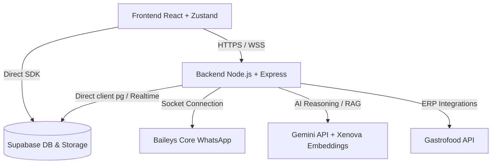

# Guia do Projeto ChatBoot & Conhecimento Técnico

Este documento centraliza as principais descobertas técnicas e regras arquiteturais do projeto ChatBoot. Ele deve ser lido e aplicado como diretriz por qualquer agente de desenvolvimento trabalhando nesta base de código.

---

## 1. Visão Geral da Arquitetura

O ChatBoot é um SaaS de atendimento via WhatsApp integrado a soluções de Inteligência Artificial e automação de Delivery (Gastrofood).

### Stack do Frontend (SaaS & Admin)
- **Framework**: React 18.3.1 + TypeScript + Vite.
- **Roteamento**: React Router DOM v7 (gerencia rotas `/chat`, `/contacts`, `/crm`, `/checklist/*`, `/admin/*`).
- **Gerenciamento de Estado**: Zustand (`src/store/chatStore.ts` de ~217KB que mantém o cache em memória de instâncias, chaves de API, mensagens e contatos).
- **Interface**: Tailwind CSS, Lucide React (ícones), Framer Motion (animações fluidas e premium).
- **Editor de Fluxos**: `@xyflow/react` para visualização e criação de robôs baseados em nós no FlowBuilder.

### Stack do Backend (WhatsApp Engine)
- **Runtime**: Node.js + Express rodando na porta `9000`.
- **Conectividade WhatsApp**: `@whiskeysockets/baileys` customizado e embutido via `baileys-core` local.
- **Inteligência Artificial**: `@google/generative-ai` (`gemini-2.5-flash`) para melhoria de texto, transcrição de áudio e arquitetura de prompts.
- **RAG & Embeddings Locais**: `@xenova/transformers` (`Xenova/all-MiniLM-L6-v2` com dimensões de 384 vetores) executado diretamente no servidor para busca semântica em lote, sem dependência de serviços externos.
- **Banco de Dados**: PostgreSQL do Supabase via driver `pg` (com migrações automáticas de DDL no startup) e `@supabase/supabase-js`.

---

## 2. Regras Críticas do Desenvolvedor

Essas regras são imutáveis e devem ser seguidas sem exceções para evitar quebras nos ambientes ativos:

> [!IMPORTANT]
> **PROIBIDO INICIAR BACKEND LOCAL**
> Nunca inicie o servidor de backend localmente na máquina (`npm run dev` ou `node src/index.js` dentro da pasta `/server`). A execução local causa problemas de concorrência graves com o banco de dados Supabase e conflitos de sessão do WhatsApp (código 409), derrubando a produção.

- **Comunicação Exclusiva com Produção**: O arquivo `.env` do front-end em execução local deve sempre manter a variável `VITE_WHATSAPP_ENGINE_URL` apontada para a URL do motor em produção na nuvem (Coolify).
- **Deploy de Backend Antes de Testar**: Alterações feitas no código do backend/servidor de produção devem obrigatoriamente ser deployadas antes de orientar o usuário a testar as funcionalidades.

### Fluxo de Deploy (`deploy!`)
Sempre que o comando ou expressão `deploy!` for solicitada, execute sequencialmente:
1. **Incremento de Versão**: Rode o script `bump.cjs` no diretório raiz (`node bump.cjs`), o qual incrementará a versão `patch` no `package.json` da raiz e do servidor.
2. **Registro de Data/Hora de Build**: Atualize a variável `VITE_PACKAGE_BUILD_DATE` no `.env` local com o ISO DateTime atual do fuso horário correto.
3. **Comando de Deploy**: Execute `npm run deploy` (que roda `npx vercel --prod --force --yes`).
4. **Relatório de Deploy**: Informe a versão gerada e o status da publicação no canal de comunicação.

---

## 3. Funcionamento Interno dos Módulos Principais

### A. Persistência de Sessão e Chaves Baileys
- **Armazenamento**: As credenciais e chaves do WhatsApp são mantidas nas tabelas `wa_auth_credentials` (credencial principal da sessão) e `wa_auth_keys` (chaves criptográficas como pre-keys, chaves de estado de aplicativo).
- **Cache de RAM**: Para evitar o gargalo da rede do banco de dados (que costuma causar erros de timeout 408 e banimento de chips), o `useSupabaseAuthState` (`server/src/session-manager/auth.js`) carrega todas as chaves em memória (`Map` de cache) no boot da sessão.
- **Escrita em Fila**: As atualizações e exclusões de chaves são enfileiradas sequencialmente por instância (`enqueueWrite`) e salvas no Supabase em blocos (chunks) de até 500 registros para otimização de escrita concorrente.

### B. Proteção Contra Conflito de Chips (Dual-Chip Check)
- No evento `connection.update` aberto, o `SessionManager` (`server/src/session-manager/index.js`) extrai o número de telefone da sessão ativa e varre as outras sessões em memória.
- Se outro socket estiver aberto com o mesmo número de WhatsApp, a conexão anterior é forçadamente fechada e o status da outra instância é atualizado no banco de dados para `offline`, detalhando o motivo.

### C. Mecanismo de Filas do EventProcessor
- O `EventProcessor` (`server/src/event-processor/index.js`) utiliza um loop de processamento em lote a cada 2 segundos (`flushQueue`) para otimizar gravações de novas mensagens e atualizações de status.
- **Race Condition Mitigation**: Atualizações de leitura e recebimento de mensagens (`delivered`, `read`) são reconciliadas em lote com atraso controlado de 1.5 segundos para garantir que a mensagem já exista no banco de dados antes da atualização de status.

### D. Motor de Fluxos (FlowEngine)
- O `FlowEngine` (`server/src/flow-runtime/index.js`) executa robôs visuais de auto-atendimento.
- **Status do Estado**: Gerencia os estados de conversa via tabela `conversation_states` (`BOT_ACTIVE`, `FINISHED`, `HANDOFF_HUMAN`).
- **Pausa de Nós (Ask)**: Nós do tipo `ask` interrompem o loop de execução automática e esperam o input do usuário, salvando a resposta em uma variável configurável.
- **Handoff**: Transfere o controle da conversa para um atendente humano e desativa o bot.
- **Anti-Looping**: Um limite máximo de iterações (`MAX_NODES_PER_EXECUTION = 25`) é imposto por tick de mensagem para abortar e fechar estados corrompidos em loops infinitos de fluxo.

### E. Gastrofood & RAG Agent
- Localizado em `server/src/automation-worker/agent.js`, implementa o agente principal que integra com o Gastrofood ERP para realizar:
  - Sincronização de cardápios com cache em memória (TTL de 10 minutos).
  - Consulta de CEP, validação de telefone de cadastro e cálculo de frete.
  - Iniciação de pagamentos Pix via QR Code.
  - Finalização estruturada do pedido no Gastrofood.
- Processa buscas semânticas utilizando RAG sobre a tabela `knowledge_chunks` com suporte a funções PL/pgSQL específicas do Supabase (`match_knowledge_chunks`).

---

## 4. Estrutura do Banco de Dados (Supabase/PostgreSQL)

Os módulos operam sobre as seguintes tabelas críticas:
- `whatsapp_instances`: Registro e status dos conectores de chips do WhatsApp.
- `contacts` e `conversations`: Dados de clientes e status da thread de conversa (`status`, `ai_paused`).
- `messages`: Mensagens enviadas e recebidas com suporte a templates, CRM e metadados.
- `wa_auth_credentials` e `wa_auth_keys`: Tokens de autenticação segura do WhatsApp Baileys.
- `knowledge_documents` e `knowledge_chunks`: Documentos de RAG com vetores gerados por embedder e buscados por similaridade do cosseno.
- `cardapio_grupos`, `cardapio_produtos`, `cardapio_passos`, `cardapio_opcoes`: Tabelas nativas para sincronização direta do catálogo de Delivery.
- `webhook_triggers`: Cadastro de webhooks que disparam ações externas em eventos como `ai_paused` e `ticket_resolved`.
