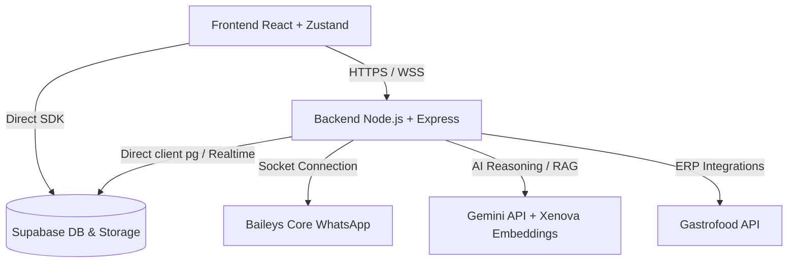

# Guia do Projeto ChatBoot & Conhecimento Técnico

Este documento centraliza as principais descobertas técnicas e regras arquiteturais do projeto ChatBoot. Ele deve ser lido e aplicado como diretriz por qualquer agente de desenvolvimento trabalhando nesta base de código.

---

## 1. Visão Geral da Arquitetura

O ChatBoot é um SaaS de atendimento via WhatsApp integrado a soluções de Inteligência Artificial e automação de Delivery (Gastrofood).

### Stack do Frontend (SaaS & Admin)
- **Framework**: React 18.3.1 + TypeScript + Vite.
- **Roteamento**: React Router DOM v7 (gerencia rotas `/chat`, `/contacts`, `/crm`, `/checklist/*`, `/admin/*`).
- **Gerenciamento de Estado**: Zustand (`src/store/chatStore.ts` de ~217KB que mantém o cache em memória de instâncias, chaves de API, mensagens e contatos).
- **Interface**: Tailwind CSS, Lucide React (ícones), Framer Motion (animações fluidas e premium).
- **Editor de Fluxos**: `@xyflow/react` para visualização e criação de robôs baseados em nós no FlowBuilder.

### Stack do Backend (WhatsApp Engine)
- **Runtime**: Node.js + Express rodando na porta `9000`.
- **Conectividade WhatsApp**: `@whiskeysockets/baileys` customizado e embutido via `baileys-core` local.
- **Inteligência Artificial**: `@google/generative-ai` (`gemini-2.5-flash`) para melhoria de texto, transcrição de áudio e arquitetura de prompts.
- **RAG & Embeddings Locais**: `@xenova/transformers` (`Xenova/all-MiniLM-L6-v2` com dimensões de 384 vetores) executado diretamente no servidor para busca semântica em lote, sem dependência de serviços externos.
- **Banco de Dados**: PostgreSQL do Supabase via driver `pg` (com migrações automáticas de DDL no startup) e `@supabase/supabase-js`.

---

## 2. Regras Críticas do Desenvolvedor

Essas regras são imutáveis e devem ser seguidas sem exceções para evitar quebras nos ambientes ativos:

> [!IMPORTANT]
> **PREVENÇÃO DE CONFLITOS NO BACKEND LOCAL**
> O backend local pode ser iniciado em ambiente de desenvolvimento, pois implementamos um mecanismo inteligente que detecta a flag `IS_LOCAL_DEV=true` ou `DISABLE_AUTO_START_SESSIONS=true` no arquivo `.env` da raiz e desativa automaticamente todos os serviços de background e triggers realtime concorrentes (como `SnoozeManager`, `QueueProcessor`, sincronização de cardápios, `WaCalls` e assinaturas realtime no Supabase). Isso impede conflitos de sessão 409 com o WhatsApp e execuções duplicadas de rotinas com o servidor de produção no Coolify.

- **Comunicação Exclusiva com Produção**: O arquivo `.env` do front-end em execução local deve sempre manter a variável `VITE_WHATSAPP_ENGINE_URL` apontada para a URL do motor em produção na nuvem (Coolify).
- **Alterações Visuais / Supabase**: Se a mudança envolver visual, comportamento de tela, estilo (CSS/Tailwind), ajustes em componentes React ou integrações diretas da aplicação com o Supabase (fora do diretório `/server`), o servidor Node.js **NÃO** deve ser atualizado, versionado ou reiniciado, evitando deploys extras desnecessários no Coolify.
- **Arquitetura Client-Side First (App + Supabase)**: Desenvolva novos recursos conectando a aplicação React diretamente com o Supabase (JS SDK, tabelas, políticas RLS), usando o servidor Node.js de backend o mínimo possível para manter a base de APIs e regras exclusivas (como Baileys, Gastrofood, RAG) do motor isoladas.
- **Deploy de Backend Antes de Testar**: Alterações feitas no código real do backend/servidor de produção devem ser deployadas antes de orientar o usuário a testar as funcionalidades.

### Fluxos de Deploy (Sugestão Proativa & Apenas Sob Demanda Explícita)

Ao concluir e verificar qualquer desenvolvimento ou correção localmente, a IA **PODE e DEVE SUGERIR** o deploy ao usuário. Porém, nenhum deploy ou `git push origin main` deve ser executado automaticamente, evitando que os webhooks do GitHub disparem builds indesejados no Coolify ou Vercel enquanto o usuário estiver testando localmente.

1. **Sugestão de Deploy**:
   - Ao finalizar a tarefa, a IA deve orientar: *"As alterações foram testadas localmente. Quando desejar enviar para produção, digite `Deploy` para Vercel ou `Deploy Server` para Coolify."*

2. **Comando `Deploy`**:
   - **Objetivo**: Deploy do frontend na Vercel.
   - **Ação**: Incrementa o `patch` no `package.json` da raiz seguindo a regra de dígito único `X.Y.Z` (máximo `9`). Atualiza `VITE_PACKAGE_BUILD_DATE` no `.env` e roda `npm run deploy` (Vercel). Relata a nova versão no chat.

3. **Comando `Deploy Server`**:
   - **Objetivo**: Deploy do backend no Coolify via Git.
   - **Ação**: Incrementa a versão no `server/package.json` seguindo a regra de dígito único `X.Y.Z` (máximo `9`), realiza o commit e o push das alterações do servidor para o GitHub, que dispara o build automático do Coolify. Relata o status no chat.

4. **Se nenhum comando for fornecido pelo usuário, nenhum git push ou deploy será efetuado.**

---

## 3. Funcionamento Interno dos Módulos Principais

### A. Persistência de Sessão e Chaves Baileys
- **Armazenamento**: As credenciais e chaves do WhatsApp são mantidas nas tabelas `wa_auth_credentials` (credencial principal da sessão) e `wa_auth_keys` (chaves criptográficas como pre-keys, chaves de estado de aplicativo).
- **Cache de RAM**: Para evitar o gargalo da rede do banco de dados (que costuma causar erros de timeout 408 e banimento de chips), o `useSupabaseAuthState` (`server/src/session-manager/auth.js`) carrega todas as chaves em memória (`Map` de cache) no boot da sessão.
- **Escrita em Fila**: As atualizações e exclusões de chaves são enfileiradas sequencialmente por instância (`enqueueWrite`) e salvas no Supabase em blocos (chunks) de até 500 registros para otimização de escrita concorrente.

### B. Proteção Contra Conflito de Chips (Dual-Chip Check)
- No evento `connection.update` aberto, o `SessionManager` (`server/src/session-manager/index.js`) extrai o número de telefone da sessão ativa e varre as outras sessões em memória.
- Se outro socket estiver aberto com o mesmo número de WhatsApp, a conexão anterior é forçadamente fechada e o status da outra instância é atualizado no banco de dados para `offline`, detalhando o motivo.

### C. Mecanismo de Filas do EventProcessor
- O `EventProcessor` (`server/src/event-processor/index.js`) utiliza um loop de processamento em lote a cada 2 segundos (`flushQueue`) para otimizar gravações de novas mensagens e atualizações de status.
- **Race Condition Mitigation**: Atualizações de leitura e recebimento de mensagens (`delivered`, `read`) são reconciliadas em lote com atraso controlado de 1.5 segundos para garantir que a mensagem já exista no banco de dados antes da atualização de status.

### D. Motor de Fluxos (FlowEngine)
- O `FlowEngine` (`server/src/flow-runtime/index.js`) executa robôs visuais de auto-atendimento.
- **Status do Estado**: Gerencia os estados de conversa via tabela `conversation_states` (`BOT_ACTIVE`, `FINISHED`, `HANDOFF_HUMAN`).
- **Pausa de Nós (Ask)**: Nós do tipo `ask` interrompem o loop de execução automática e esperam o input do usuário, salvando a resposta em uma variável configurável.
- **Handoff**: Transfere o controle da conversa para um atendente humano e desativa o bot.
- **Anti-Looping**: Um limite máximo de iterações (`MAX_NODES_PER_EXECUTION = 25`) é imposto por tick de mensagem para abortar e fechar estados corrompidos em loops infinitos de fluxo.

### E. Gastrofood & RAG Agent
- Localizado em `server/src/automation-worker/agent.js`, implementa o agente principal que integra com o Gastrofood ERP para realizar:
  - Sincronização de cardápios com cache em memória (TTL de 10 minutos).
  - Consulta de CEP, validação de telefone de cadastro e cálculo de frete.
  - Iniciação de pagamentos Pix via QR Code.
  - Finalização estruturada do pedido no Gastrofood.
- Processa buscas semânticas utilizando RAG sobre a tabela `knowledge_chunks` com suporte a funções PL/pgSQL específicas do Supabase (`match_knowledge_chunks`).

---

## 4. Estrutura do Banco de Dados (Supabase/PostgreSQL)

Os módulos operam sobre as seguintes tabelas críticas:
- `whatsapp_instances`: Registro e status dos conectores de chips do WhatsApp.
- `contacts` e `conversations`: Dados de clientes e status da thread de conversa (`status`, `ai_paused`).
- `messages`: Mensagens enviadas e recebidas com suporte a templates, CRM e metadados.
- `webhook_triggers`: Cadastro de webhooks que disparam ações externas em eventos como `ai_paused` e `ticket_resolved`.
- `wa_auth_credentials` e `wa_auth_keys`: Tokens de autenticação segura do WhatsApp Baileys.

---

## 5. Prevenção de Condições de Corrida e Regras de Pareamento (Código/QR)

Para evitar quebras de sincronismo e instâncias travadas em estado de conexão (`connecting`), siga as seguintes regras arquiteturais:

### A. Restrição de Eventos de Pareamento no Boot
O listener do evento `creds.update` em instâncias Baileys **nunca** deve atualizar o status do banco de dados para `"connecting"` ou emitir eventos de `pairingSuccess` se a sessão já estava previamente autenticada no momento do boot do contêiner/worker (`wasAuthenticatedOnBoot === true`). Isso impede que a re-inicialização automática ou oscilações de rede normais em sessões estáveis forcitem a interface de volta para `"connecting"`.

### B. Registro Síncrono de Sessão Ativa
Ao mudar o estado da conexão para `'open'`, a sessão correspondente deve ser inserida na lista de sessões autenticadas na memória (`this.authenticatedSessions.add(instanceId)`) de forma **síncrona e imediata** no início do listener de `connection.update`, antes de qualquer operação assíncrona (`await`). Isso elimina a janela de tempo (race condition) onde eventos simultâneos de `creds.update` leriam o estado em memória como falso e corromperiam o status no banco de dados.

### C. Atualização Ativa no Debounce do Store (Frontend)
O método `setInstanceStatus` no [chatStore.ts](file:///c:/Users/NOTE-(FORM)02JUL26/Documents/Projetos/Antigravity/ChatBoot/src/store/chatStore.ts) gerencia uma verificação assíncrona contra oscilações (`_offline_checks_${id}`). Caso essa rotina detecte que a instância retornou para o status `"connected"` ou `"connected_local"` no Supabase, ela deve **obrigatoriamente gravar o estado atualizado no store** imediatamente, em vez de apenas limpar o intervalo, garantindo o desaparecimento imediato dos banners de alerta ("Restabelecendo Conexão") no painel do usuário.

### D. Restrição de Chaves de Acesso (Passkeys) no WhatsApp
*   **Problema de Círculo Fechado (Catch-22)**: O WhatsApp implementa uma verificação de segurança ("Shortcake") que exige a assinatura de um desafio WebAuthn (`passkey_prologue_request`) quando a conta tem uma Chave de Acesso ativa. Headless clients (como o Baileys rodando em VPS) não possuem o assinante local (`signPasskeyAssertion`), fazendo com que a conexão expire.
*   **Restrição de Exclusão da Passkey**: Em contas com score de risco elevado ou sob políticas de segurança rígidas do WhatsApp, a remoção da Chave de Acesso no celular faz com que o aplicativo exiba a mensagem: `"Criar uma chave de acesso para entrar - Por questões de segurança, sua conta precisa de uma chave de acesso para conectar dispositivos."` impedindo a vinculação de qualquer dispositivo sem a criação de uma nova chave de acesso.
*   **Soluções Alternativas Conhecidas**:
    1.  **Migração para WhatsApp Business**: Contas do WhatsApp Business possuem políticas de segurança mais flexíveis quanto a pareamento e geralmente aceitam conexões sem exigir a criação forçada de Chave de Acesso.
    2.  **Período de Resfriamento (Cooling Period)**: Deixar a conta sem tentativas de pareamento por 48 a 72 horas para que o score de risco do WhatsApp expire, permitindo a conexão no fluxo clássico sem passkey.
    3.  **Reinstalação ou Troca de Aparelho**: Limpar os dados/cache do WhatsApp (ou reinstalar com backup prévio) para resetar o score de segurança local do dispositivo.

---

## 6. Tratamento de LIDs e Resolução do Erro 463 (Reachout Timelocked)

Para garantir o envio de mensagens para contatos com Login ID (LID) ativo sem disparar o erro `463` (NackCallerReachoutTimelocked) ou causar contatos duplicados e invisíveis no CRM, siga estritamente estas diretrizes:

### A. Domínio Correto de Envio (`@lid`)
O WhatsApp exige que envios para contatos cujos chips foram migrados para identificadores de login (LID) utilizem o domínio `@lid` (ex: `150547344662594@lid`). Tentar enviar para um LID utilizando o domínio clássico `@s.whatsapp.net` causará rejeição instantânea com o erro `463`.
* O resolvedor de filas (`queue-processor.js`) deve traduzir o JID telefônico do destinatário para o JID LID correspondente em memória RAM antes do envio.

### B. Aquisição de Token de Privacidade (`tctoken`) e Delay de Handshake
Quando o token de segurança (`tctoken`) não estiver presente no cache de chaves, o sistema deve forçar a troca de chaves na rede do WhatsApp:
1. Chame o método `sock.onWhatsApp(...)` passando **obrigatoriamente o JID de telefone clássico** (o método do Baileys não suporta LIDs diretos).
2. Introduza um **delay síncrono de pelo menos 2 segundos** (`setTimeout`/`Promise`) logo após a consulta para permitir que a biblioteca receba a resposta assíncrona do servidor, processe o aperto de mão criptográfico E2E no background e salve o `tctoken` na memória.

### C. Proteção do JID de Telefone no Banco de Dados
* **Nunca** atualize a coluna `whatsapp_jid` da tabela `contacts` no Supabase para `@lid`. O banco de dados deve preservar o JID clássico de telefone (`@s.whatsapp.net`).
* O frontend React descarta e oculta contatos cujo JID contém `@lid` devido a filtros visuais. Manter o JID clássico no banco de dados impede que o contato desapareça no painel e garante que o queue-processor continue resolvendo o JID localmente em tempo de execução de forma invisível para o usuário.

### D. Tradução Reversa de LID no EventProcessor
Para evitar que confirmações de entrega (ACKs) ou eventos de recebimento gerados por LIDs criem contatos duplicados no CRM:
* Intercepte o processamento no `handleMessageUpsert` do `event-processor/index.js`. Se o JID da mensagem recebida contiver `@lid`, consulte o mapeamento reverso `lid-mapping-[LID]_reverse` no cache de chaves da instância para traduzir o JID de volta para o telefone correspondente antes de qualquer salvamento ou atualização no banco.

