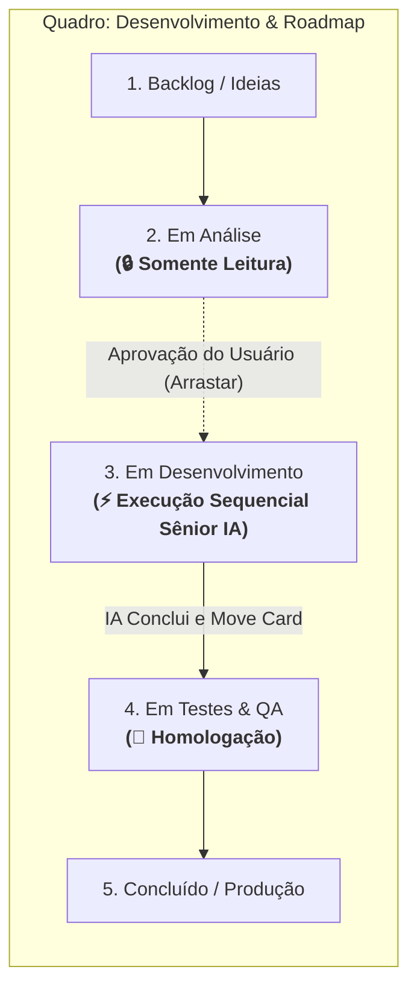
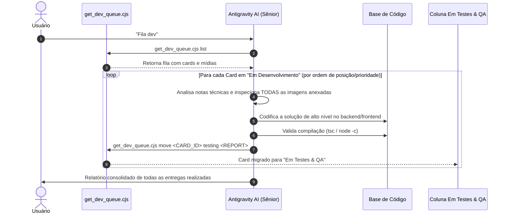

# Skill: Esteira de Governança, Engenharia Sênior e Execução Autônoma "Fila Dev"

> ⚡ **GATILHO DE ATIVAÇÃO**: Digite `Fila dev` (ou variações como `fila dev`, `Fila Dev`, `/fila-dev` ou `fila dev.`) no chat para executar este protocolo automaticamente.

Esta skill rege a governança e o pipeline de execução autônoma do quadro **Desenvolvimento & Roadmap** (`ID: 95be1dee-9d28-47d9-8ccf-d51a337f1572`) no CRM Kanban.

---

## 🏛️ 1. Filosofia de Governança e Papel Sênior



### 🧠 Postura e Conhecimento Técnico Exigido (Staff / Principal Engineer)
Ao assumir um card para desenvolvimento, a IA **NÃO** deve fazer correções superficiais ou parciais. Ela atua com **altíssimo nível técnico**, incorporando:
- **Arquitetura & Clean Code**: SOLID, DRY, modularidade, separação de responsabilidades e tratamento preventivo de exceções.
- **Resiliência de Backend & Concorrência**: Prevenção de deadlocks, leases distribuídos, tratamento de sockets Baileys e integridade transacional.
- **Banco de Dados & Supabase**: Políticas RLS, índices, triggers, schema cache do PostgREST e consistência multitenant.
- **Design System & UI/UX**: Mobile First, glassmorphism, tipografia moderna, acessibilidade e micro-animações.

---

## 🔍 2. Inspeção Obrigatória de Imagens, Capturas e Evidências Visuais

Cada card pode conter capturas de tela, fotos de terminais, fluxogramas ou prints de erros anexados no markdown (`notes`) ou no Supabase Storage (`chat_media/crm_cards`).

### Protocolo de Análise Visual:
1. **Identificar Anexos**: Ler os campos `attached_media` e `media_count` retornados pelo script `get_dev_queue.cjs`.
2. **Abrir e Inspecionar Visualmente Cada Imagem**:
   - Usar as ferramentas de visualização (`view_file` ou download temporário) para analisar os prints de erro, layouts de tela ou telas de teste.
   - Compreender exatamente o que o usuário/sistema destacou no print (ex: botões sobrepostos, erros de console, estados de botões, valores incorretos).
3. **Correlacionar com o Código-Fonte**: Cruzar os elementos visuais vistos na imagem com os componentes React, rotas Express ou registros do Supabase antes de realizar qualquer alteração.

---

## 🔄 3. Processamento Contínuo e Sequencial da Fila ("Tratar a Fila")

O comando **`Fila dev`** trata a fila de forma **contínua e exaustiva** até zerar todos os itens da coluna **"Em Desenvolvimento"** (`development`).



---

## 🔒 4. Regras Estritas de Governança por Coluna

### 🔒 Coluna "Em Análise" (`status: 'analysis'`):
- **PROIBIDO INICIAR CODIFICAÇÃO**: A IA **NÃO PODE** alterar código nem iniciar tarefas que estejam nesta coluna.
- **VISUALIZAÇÃO TRANSPARENTE**: Exibir a listagem clara dos cards em análise, informando ao usuário que aguardam autorização prévia (arrastar para "Em Desenvolvimento").

### ⚡ Coluna "Em Desenvolvimento" (`status: 'development'`):
- **EXECUÇÃO AUTÔNOMA TOTAL & SEQUENCIAL**:
  1. A IA extrai o primeiro card prioritário da fila.
  2. Inspeciona todas as imagens e notas técnicas.
  3. Realiza o desenvolvimento completo e refatoração necessária com qualidade sênior.
  4. Valida a compilação (`npm run build` ou `node -c`).
  5. Migra o card para **"Em Testes & QA"** (`testing`).
  6. **Avança imediatamente para o próximo card da fila e repete o processo até que a coluna esteja vazia (0 cards).**

---

## 🛠️ 5. Comandos e Scripts de Apoio

### 1. Consultar a Fila em Tempo Real:
```bash
node .agents/skills/fila-dev/scripts/get_dev_queue.cjs list
```

### 2. Migrar Card com Relatório Técnico de Entrega:
```bash
node .agents/skills/fila-dev/scripts/get_dev_queue.cjs move <ID_DO_CARD> testing '{"summary":"Descrição detalhada das funções criadas/refatoradas e correções aplicadas","files":["src/...","server/..."]}'
```
