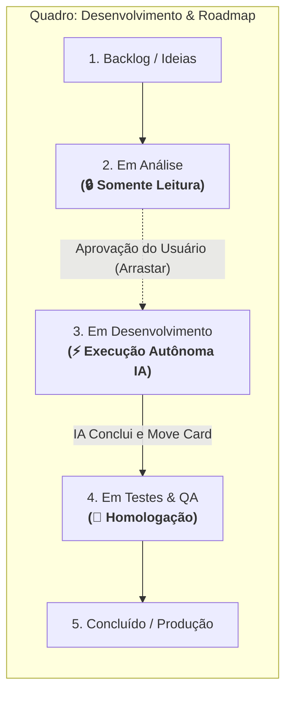

# Skill: Esteira de Governança e Execução Autônoma "Fila Dev"

> ⚡ **GATILHO DE ATIVAÇÃO**: Digite `Fila dev` (ou variações como `fila dev`, `Fila Dev`, `/fila-dev` ou `fila dev.`) no chat para executar este protocolo automaticamente.

Esta skill estabelece a governança e o pipeline de execução autônoma do quadro **Desenvolvimento & Roadmap** (`ID: 95be1dee-9d28-47d9-8ccf-d51a337f1572`) no CRM Kanban.

---

## 🏛️ 1. Filosofia de Governança por Colunas



### 🔒 Regra da Coluna "Em Análise" (`status: 'analysis'`):
- **PROIBIDO DESENVOLVER OU MODIFICAR CÓDIGO**: A IA **NÃO** deve iniciar implementação, refatoração ou criação de código para tarefas que estejam nesta coluna.
- **VISUALIZAÇÃO COMPLETA**: A IA deve ler todos os cards desta coluna e apresentar uma visão clara (título, prioridade, resumo e tags) ao usuário, informando que os itens aguardam aprovação manual (arrastar para "Em Desenvolvimento").

### ⚡ Regra da Coluna "Em Desenvolvimento" (`status: 'development'`):
- **AUTONOMIA TOTAL DE CODIFICAÇÃO**: Quando um card estiver nesta coluna, o Antigravity tem autorização explícita para:
  1. Ler o objetivo, diagnóstico e plano técnico contidos no card (`notes` / `summary`).
  2. Implementar as alterações de código necessárias nos arquivos indicados.
  3. Validar a compilação (`npx tsc --noEmit` ou testes pertinentes).
  4. **Mover o card no banco de dados para "Em Testes & QA"** (`status: 'testing'`) através do comando:
     `node .agents/skills/fila-dev/scripts/get_dev_queue.cjs move <CARD_ID> testing`
  5. Apresentar o relatório da entrega e a confirmação de que o card foi migrado para testes.

---

## 🛠️ 2. Protocolo de Execução do Comando "Fila dev"

Sempre que o usuário digitar `Fila dev`:

### Passo 1: Consulta da Fila em Tempo Real
Executar o script oficial:
```bash
node .agents/skills/fila-dev/scripts/get_dev_queue.cjs list
```

### Passo 2: Decisão de Fluxo

#### Cenário A: Existem Cards na Fila "Em Desenvolvimento"
1. Listar os cards em desenvolvimento e selecionar o item prioritário.
2. Analisar o conteúdo técnico do card (`notes`, arquivos e objetivo).
3. Executar o desenvolvimento completo (edição de código, criação de funções, correções).
4. Validar que não há erros de compilação TypeScript (`npx tsc --noEmit`).
5. Migrar o card para a coluna **"Em Testes & QA"** com o relatório técnico de entrega documentado:
   ```bash
   node .agents/skills/fila-dev/scripts/get_dev_queue.cjs move <ID_DO_CARD> testing '{"summary":"Descrição completa das funções e arquivos modificados","files":["server/src/session-manager/index.js"]}'
   ```
6. Apresentar o relatório da entrega e a tabela atualizada da esteira.

#### Cenário B: Não Existem Cards "Em Desenvolvimento" (Apenas "Em Análise" e/ou "Backlog")
1. Apresentar a tabela consolidada de todos os cards da fila.
2. Listar em destaque os cards que estão **"Em Análise"**, reforçando que nenhum código foi alterado pois aguardam autorização (arrastar para "Em Desenvolvimento").
3. Orientar o usuário a mover o card desejado para a coluna "Em Desenvolvimento" no Kanban (`/crm/kanban/95be1dee-9d28-47d9-8ccf-d51a337f1572`) e digitar `Fila dev` novamente para disparar a codificação.
