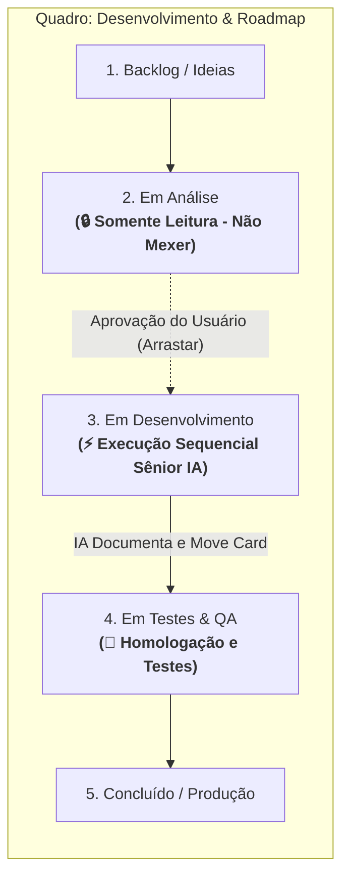
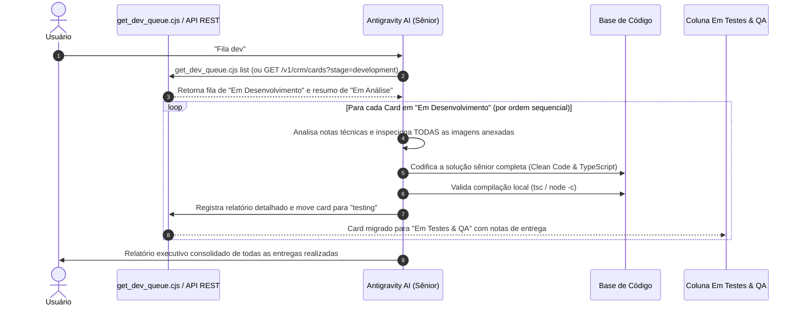

# Skill: Esteira de Governança, Engenharia Sênior e Execução Autônoma "Fila Dev"

> ⚡ **GATILHO DE ATIVAÇÃO**: Digite `Fila dev` (ou variações como `fila dev`, `Fila Dev`, `/fila-dev` ou `fila dev.`) no chat para executar este protocolo automaticamente.

Esta skill rege a governança e o pipeline de execução autônoma do quadro **Desenvolvimento & Roadmap** (`ID: 95be1dee-9d28-47d9-8ccf-d51a337f1572`) no CRM Kanban.

---

> [!CRITICAL]
> **REGRA DE OURO E GOVERNANÇA INVIOLÁVEL DA FILA DEV**:
> 1. **FOCO EXCLUSIVO NA LISTA 'Em Desenvolvimento' (`status === 'development'`)**:
>    - A IA **SÓ DEVE** pegar, assumir e processar cards que estejam estritamente na lista/coluna **'Em Desenvolvimento'**.
> 2. **BLOQUEIO TOTAL DA LISTA 'Em Análise' (`status === 'analysis'`) E 'Backlog'**:
>    - É **ESTRITAMENTE PROIBIDO** mexer, codificar ou mover cards da lista **'Em Análise'**. Eles aguardam aprovação manual do usuário. A IA apenas lista esses cards de forma transparente para conhecimento.
> 3. **DOCUMENTAÇÃO OBRIGATÓRIA DA ENTREGA & ENVIO PARA 'Em Testes & QA' (`status === 'testing'`)**:
>    - Ao concluir o desenvolvimento de cada card, a IA **DEVE OBRIGATORIAMENTE**:
>      a) Registrar um relatório técnico detalhado documentando o que foi feito (resumo executivo, arquivos alterados, componentes criados e testes de validação).
>      b) Mover/enviar o card imediatamente para a lista **'Em Testes & QA'** (`status: 'testing'`).
>    - Após mover o card para QA, avançar imediatamente para o próximo card de 'Em Desenvolvimento' até zerar toda a lista.

---

## 🏛️ 1. Filosofia de Governança e Papel Sênior


```mermaid
graph LR
    subgraph CRM_KANBAN["Quadro: Desenvolvimento & Roadmap"]
        A["1. Backlog / Ideias"] --> B["2. Em Análise<br/><b>(🔒 Somente Leitura - Não Mexer)</b>"]
        B -.->|"Aprovação do Usuário (Arrastar)"| C["3. Em Desenvolvimento<br/><b>(⚡ Execução Sequencial Sênior IA)</b>"]
        C -->|"IA Documenta e Move Card"| D["4. Em Testes & QA<br/><b>(🧪 Homologação e Testes)</b>"]
        D --> E["5. Concluído / Produção"]
    end
```

### 🧠 Postura e Conhecimento Técnico Exigido (Staff / Principal Engineer)
Ao assumir um card para desenvolvimento, a IA **NÃO** deve fazer correções superficiais ou parciais. Ela atua com **altíssimo nível técnico**, incorporando:
- **Arquitetura & Clean Code**: SOLID, DRY, modularidade, separação de responsabilidades e tratamento preventivo de exceções.
- **Resiliência de Backend & Concorrência**: Prevenção de deadlocks, leases distribuídos, tratamento de sockets Baileys e integridade transacional.
- **Banco de Dados & Supabase**: Políticas RLS, índices, triggers, schema cache do PostgREST e consistência multitenant.
- **Design System & UI/UX**: Mobile First, glassmorphism, tipografia moderna, acessibilidade e micro-animações.

---

## 🔍 2. Inspeção Obrigatória de Imagens, Capturas e Evidências Visuais

Cada card pode conter capturas de tela, fotos de terminais, fluxogramas ou prints de erros anexados no markdown (`notes`) ou no Supabase Storage (`chat_media/crm_cards`).

### Protocolo de Análise Visual:
1. **Identificar Anexos**: Ler os campos `attached_media` e `media_count` retornados pelo script `get_dev_queue.cjs` ou pela API REST (`ai_context.image_urls_for_vision`).
2. **Abrir e Inspecionar Visualmente Cada Imagem**:
   - Usar as ferramentas de visualização (`view_file` ou download temporário) para analisar os prints de erro, layouts de tela ou telas de teste.
   - Compreender exatamente o que o usuário/sistema destacou no print (ex: botões sobrepostos, erros de console, estados de botões, valores incorretos).
3. **Correlacionar com o Código-Fonte**: Cruzar os elementos visuais vistos na imagem com os componentes React, rotas Express ou registros do Supabase antes de realizar qualquer alteração.

---

## ⚡ 2.1 Ativação Obrigatória das Skills do Superpowers Citadas no Card

Cada card criado via **"Criar Card Multimodal & IA"** (por áudio, texto, prints ou vídeos) possui mapeamento das skills do framework **Superpowers**:

1. **Leitura das Skills Recomendadas**:
   - Inspecionar o campo `recommended_skills` do script `get_dev_queue.cjs list` ou as menções `@skill:nome-da-skill` presentes na seção `### ⚡ Protocolo de Execução com Skills Superpowers` dentro das `notes` do card.
2. **Ativação e Execução Estrita**:
   - A IA desenvolvedora deve ler e seguir o protocolo da respectiva skill localizada em `C:\Users\NOTE-(FORM)02JUL26\.gemini\config\plugins\superpowers\skills/<skill_name>/SKILL.md`:
     - 🔍 **`systematic-debugging`**: Investigar a causa raiz, inspecionar logs e estados antes de tentar propor qualquer correção de código.
     - 🧪 **`test-driven-development`**: Elaborar testes de validação ou verificação prévia de falha (Red) antes de aplicar a solução (Green).
     - ✅ **`verification-before-completion`**: OBRIGATÓRIA antes de encerrar o card: executar comandos de compilação (`npx tsc --noEmit` ou testes) e coletar evidências reais do sucesso.
     - 📝 **`writing-plans`** / ⚙️ **`executing-plans`**: Seguir rigorosamente o plano técnico e arquivos impactados descritos no card.
     - 🎨 **`ui-ux-enhancement`**: Aplicar análise de 10 pontos, Mobile First e glassmorphism caso o card envolva interface.
3. **Registro na Entrega**:
   - No relatório de entrega ao mover para **'Em Testes & QA'**, relatar como as skills recomendadas foram aplicadas e as evidências obtidas.

---

## 🔄 3. Processamento Contínuo e Sequencial da Fila ("Tratar a Fila")

O comando **`Fila dev`** trata a fila de forma **contínua e exaustiva** até zerar todos os itens da coluna **"Em Desenvolvimento"** (`development`).


```mermaid
sequenceDiagram
    autonumber
    actor User as Usuário
    participant Script as get_dev_queue.cjs / API REST
    participant AI as Antigravity AI (Sênior)
    participant Code as Base de Código
    participant QA as Coluna Em Testes & QA

    User->>AI: "Fila dev"
    AI->>Script: get_dev_queue.cjs list (ou GET /v1/crm/cards?stage=development)
    Script-->>AI: Retorna fila de "Em Desenvolvimento" e resumo de "Em Análise"
    loop Para cada Card em "Em Desenvolvimento" (por ordem sequencial)
        AI->>AI: Analisa notas técnicas e inspeciona TODAS as imagens anexadas
        AI->>Code: Codifica a solução sênior completa (Clean Code & TypeScript)
        AI->>Code: Valida compilação local (tsc / node -c)
        AI->>Script: Registra relatório detalhado e move card para "testing"
        Script-->>QA: Card migrado para "Em Testes & QA" com notas de entrega
    end
    AI->>User: Relatório executivo consolidado de todas as entregas realizadas
```

---

## 🔒 4. Regras Estritas de Governança por Coluna

### 🔒 Coluna "Em Análise" (`status: 'analysis'`):
- **PROIBIDO INICIAR CODIFICAÇÃO**: A IA **NÃO PODE** alterar código nem iniciar tarefas que estejam nesta coluna.
- **VISUALIZAÇÃO TRANSPARENTE**: Exibir a listagem clara dos cards em análise, informando ao usuário que aguardam autorização prévia (arrastar para "Em Desenvolvimento").

### ⚡ Coluna "Em Desenvolvimento" (`status: 'development'`):
- **EXECUÇÃO AUTÔNOMA TOTAL & SEQUENCIAL**:
  1. A IA extrai o primeiro card prioritário da fila de 'Em Desenvolvimento'.
  2. Inspeciona todas as imagens e notas técnicas.
  3. Realiza o desenvolvimento completo e refatoração necessária com qualidade sênior.
  4. Valida a compilação (`npm run build` ou `node -c`).
  5. Documenta o que foi feito com clareza técnica.
  6. Migra o card para **"Em Testes & QA"** (`testing`).
  7. **Avança imediatamente para o próximo card da fila e repete o processo até que a coluna esteja vazia (0 cards).**

---

## 🛠️ 5. Comandos e Scripts de Apoio

### 1. Consultar a Fila em Tempo Real:
```bash
node .agents/skills/fila-dev/scripts/get_dev_queue.cjs list
```

### 2. Migrar Card com Relatório Técnico de Entrega:
```bash
node .agents/skills/fila-dev/scripts/get_dev_queue.cjs move <ID_DO_CARD> testing '{"summary":"Descrição detalhada das funções criadas/refatoradas e correções aplicadas","files":["src/...","server/..."]}'
```

### 3. Adicionar Novo Item / Demanda na Fila Dev:
```bash
node .agents/skills/fila-dev/scripts/get_dev_queue.cjs add "Título da Demanda" "Notas técnicas detalhadas" [prioridade 1-3] [status_inicial] '["TAG1", "TAG2"]'
```

### 4. Adicionar Comentário / Update em um Card:
```bash
node .agents/skills/fila-dev/scripts/get_dev_queue.cjs comment <ID_DO_CARD> "Texto do comentário técnico" "Nome do Autor"
```

### 5. Atribuir Desenvolvedor Responsável:
```bash
node .agents/skills/fila-dev/scripts/get_dev_queue.cjs assign <ID_DO_CARD> "Nome do Desenvolvedor"
```

### 6. Fechar Demanda com Resolução Oficial:
```bash
node .agents/skills/fila-dev/scripts/get_dev_queue.cjs close <ID_DO_CARD> done '{"summary":"Resolução validada e aprovada"}'
```

