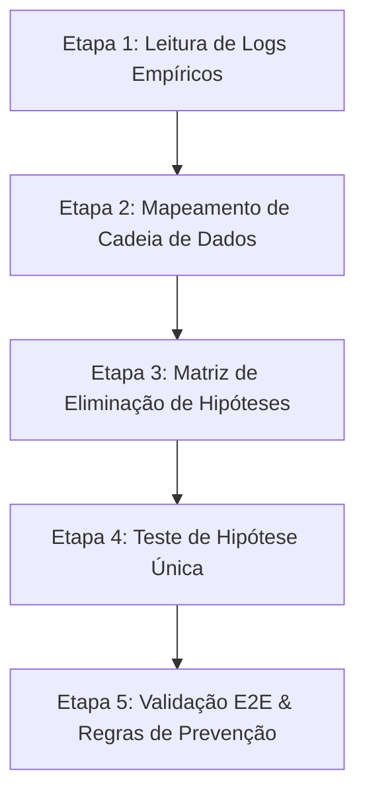

# Skill de Análise Causal Raiz & Diagnóstico Estruturado (Root Cause Analysis)

Esta skill define o protocolo obrigatório de investigação e resolução de problemas complexos ou recorrentes no projeto ChatBoot (como desconexões de WhatsApp, falhas de envio de mensagens, perda de estado ou erros de sincronização).

---

## 1. Diretriz de Acionamento Automático

> [!IMPORTANT]
> **REGRA DE OURO DE RECORRÊNCIA**: Sempre que o usuário relatar ou solicitar a correção de um mesmo problema por **2 ou mais vezes** (ou demonstrar frustração com a persistência de um comportamento inesperado), o agente DEVE:
> 1. Invocar e aplicar estritamente o protocolo de 5 etapas desta skill.
> 2. Informar ao usuário que está acionando o **Protocolo de Análise Causal Raiz e Trilha de Migalhas (DevLogger)** para isolar o ponto exato da falha antes de editar qualquer lógica.

---

## 2. Protocolo de 5 Etapas de Diagnóstico Estruturado

### Etapa 1: Leitura de Logs Empíricos & Trilha de Migalhas (DevLogger)
- **NÃO FAÇA SUPOSIÇÕES**. O primeiro passo é inspecionar os logs de migalhas (`[MIGALHA X/Y]`) no **Antigravity DevLogger** (`useDevStore`) e na tabela `system_logs` do Supabase.
- Verifique a sequência exata de eventos de 1 a 7 do ciclo de conexão ou de envio de mensagem:
  - `[MIGALHA 1/7]`: Parâmetros de entrada da solicitação (Tenant ID, Instance UUID, API Key).
  - `[MIGALHA 2/7]`: Resposta HTTP do Gateway / Node Express.
  - `[MIGALHA 3/7]`: Inscrição Realtime Supabase no canal `tenant:T:instance:I`.
  - `[MIGALHA 4/7]`: Payload de `instance.qr_updated` ou `pairingCode`.
  - `[MIGALHA 5/7]`: Status de broadcast (`offline`, `connecting`, `qr_ready`, `connected`).
  - `[MIGALHA 6/7]`: Handshake do soquete Baileys (`connection.update` / `last_error`).
  - `[MIGALHA 7/7]`: Salvamento de estado persistente no banco Supabase.

### Etapa 2: Mapeamento da Cadeia de Dados (End-to-End Flow)
Mapeie o fluxo de dados em cada camada para encontrar onde o elo se rompeu:
1. **Interface (UI / React)** -> Verifique se o ID passado é um UUID válido ou nome amigável.
2. **Estado (Zustand Store)** -> Verifique se o seletor é reativo e atualizou a UI.
3. **API (HTTP Gateway)** -> Verifique os parâmetros e headers de autorização.
4. **Worker (Node.js Engine)** -> Verifique se o soquete Baileys estava ativo ou travado no `SessionManager`.
5. **Realtime / DB (Supabase)** -> Verifique se o evento de broadcast foi entregue e se a tabela `whatsapp_instances` reflete o status correto.

### Etapa 3: Matriz de Eliminação de Hipóteses
Crie uma tabela mental ou documentada de hipóteses e elimine cada uma com evidência de log:

| Hipótese | Causa Possível | Evidência de Log / Teste | Status |
| :--- | :--- | :--- | :--- |
| 1. ID Inválido | Transmissão de `display_name` ao invés de UUID | Evidenciado no payload do DevLogger | ✅/❌ |
| 2. Sessão Corrompida em Memória | Soquete em estado zumbi no Node.js | Logs de `DisconnectReason` no Baileys | ✅/❌ |
| 3. Oscilação de Redes / Fetch | Falha temporária de DNS ou timeout VPS | HTTP status / `TypeError: Failed to fetch` | ✅/❌ |
| 4. Desconexão do Celular / Passkey | Dispositivo desconectou por inatividade | Broadcast `last_error` no Supabase | ✅/❌ |

### Etapa 4: Teste de Hipótese Única (Isolado)
- Aplique **apenas a correção referente à hipótese confirmada por evidências**.
- Não altere múltiplos pontos do sistema simultaneamente para não mascarar a causa primária.

### Etapa 5: Validação E2E & Regras de Prevenção
- Execute o build (`npm run build`).
- Verifique se a Trilha de Migalhas no DevLogger confirma o sucesso nos passos de 1 a 7.
- Adicione uma trava defensiva (guardrail) para impedir que esse erro volte a ocorrer.

---

## 3. Checklist de Diagnóstico de Conexão WhatsApp

Quando a conexão do WhatsApp apresentar falha ao gerar QR Code ou desconectar:

- [ ] O ID passado para `openQRModal()` é um UUID de 36 caracteres?
- [ ] O evento Realtime `instance.qr_updated` está sendo transmitido pelo Node.js?
- [ ] Há credenciais antigas na tabela `whatsapp_instances` impedindo a geração de novo par de chaves?
- [ ] O Baileys devolveu `disconnect.reason` (ex: `401 Unauthorized`, `408 Timeout`, `405 Logged Out`, `515 Restart Required`)?
- [ ] O DevLogger registrou todas as migalhas de 1/7 a 7/7 sem lacunas?
