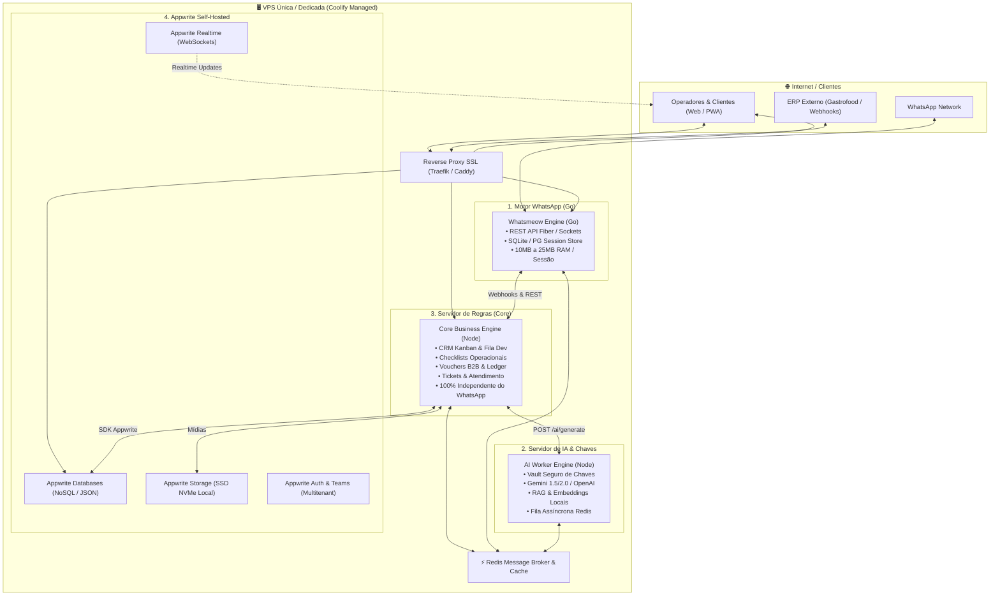

# 🏛️ Especificação Técnica da Arquitetura Next-Gen (v8.0)

Este documento define a nova arquitetura do ecossistema **ChatBoot**, concebida para **Alta Disponibilidade (99.99%)**, isolamento de falhas, eliminação de custos recorrentes de cloud de terceiros e escalabilidade linear em infraestrutura própria (VPS Self-Hosted com **Coolify** e **Appwrite**).

---

## 🎯 1. Os 4 Pilares da Nova Arquitetura



---

## 🚀 2. Comparativo: Stack Atual vs. Nova Stack Next-Gen

| Critério | Stack Atual (v7.x) | Nova Stack Next-Gen (v8.x) | Ganho Estratégico |
| :--- | :--- | :--- | :--- |
| **Motor WhatsApp** | Baileys (Node.js) | **Whatsmeow (Go Nativo)** | **10x menos memória** (15MB vs 180MB/sessão), zero travamentos de Garbage Collector. |
| **Banco de Dados** | Supabase Cloud (Postgres) | **Appwrite Self-Hosted (VPS)** | **Custo $0 de nuvem externa**, sem limites de conexões pool ou egress de dados. |
| **Servidor de IA** | Acoplado no worker de automação | **Microserviço Dedicado de IA** | Chaves de API isoladas em vault, fila de geração assíncrona, não bloqueia o chat. |
| **Regras de Negócio** | Acopladas ao ciclo do Baileys | **Core Business Engine Independente** | **CRM e Checklists continuam 100% no ar** mesmo se instâncias de WhatsApp reiniciarem. |
| **Storage de Mídias** | Supabase Storage (Cloud) | **Appwrite Storage Local (SSD/NVMe)** | Armazenamento de áudios, comprovantes e fotos ilimitado sem cobrança por GB. |
| **Orquestração** | Deploy misto Vercel + Coolify | **Coolify Centralizado na VPS** | Monitoramento unificado, healthchecks automáticos e rollback instantâneo. |

---

## ⚡ 3. Detalhamento dos 4 Microserviços

### 🔹 Serviço 1: Whatsmeow Engine (Go)
* **Repositório oficial**: [tulir/whatsmeow](https://github.com/tulir/whatsmeow)
* **Linguagem**: Go (Golang 1.22+)
* **Responsabilidade Exclusiva**:
  - Manter sockets WhatsApp multidevice de alta performance.
  - Gerenciar pareamento via QR Code e reconexão com backoff exponencial.
  - Encriptação e decriptação Signal Protocol executada em binário compilado.
  - Expor API REST leve para envio de texto, áudio PTT, imagens, documentos e botões.
  - Disparar Webhooks HTTP imediatos para o **Core Business Engine** ao receber mensagens ou recibos (`sent`, `delivered`, `read`).

### 🔹 Serviço 2: AI Worker Service (Vault de Chaves & RAG)
* **Linguagem**: Node.js 22 LTS / Fastify
* **Responsabilidade Exclusiva**:
  - Centralizar todas as chaves secretas de provedores de IA (`GEMINI_API_KEY`, `OPENAI_API_KEY`, `GROQ_API_KEY`, etc.) em um único container isolado da internet externa.
  - Executar embeddings e busca vetorial (RAG) em bases de conhecimento e cardápios digitais.
  - Processar filas assíncronas de IA via Redis para garantir tempo de resposta previsível.
  - Rate-limiting por tenant e quotas de consumo para proteção financeira contra abusos.

### 🔹 Serviço 3: Core Business Engine (Regras de Negócio)
* **Linguagem**: Node.js Express / Fastify
* **Responsabilidade Exclusiva**:
  - CRM Kanban e pipelines de vendas (incluindo fila automatizada de desenvolvimento).
  - Checklists operacionais, tablets de conformidade de cozinha e auditoria fotográfica.
  - Vouchers corporativos B2B, leitura de QR Codes e extrato financeiro (ledger).
  - Tickets de atendimento, triagem automática, handoff Bot ➔ Humano.
  - Integrações com ERPs (Gastrofood) com cache persistente e janela de proteção de 1 hora.
  - **Zero acoplamento**: Se o WhatsApp cair ou sofrer banimento, as regras operacionais da empresa não sofrem interrupção.

### 🔹 Serviço 4: Appwrite Self-Hosted (BaaS Próprio na VPS)
* **Responsabilidade Exclusiva**:
  - **Databases**: Coleções de `conversations`, `messages`, `checklists`, `vouchers`, `crm_cards`.
  - **Realtime**: WebSockets nativos para sincronizar mensagens, status de digitação e cards no frontend.
  - **Storage**: Buckets locais para arquivos, fotos de checklists e áudios de clientes no SSD local.
  - **Auth & Teams**: Isolamento multitenant nativo por equipes/tenants via permissões granulares de coleção.

---

## 🛡️ 4. Estratégia de Alta Disponibilidade (HA) & Escalabilidade

1. **Self-Healing e Healthchecks**:
   - Cada container possui `HEALTHCHECK` configurado no Dockerfile.
   - O Coolify monitora a porta interna a cada 10 segundos. Se qualquer serviço falhar 3 vezes consecutivas, é reiniciado em menos de 3 segundos com rollback transparente.
2. **Buffer de Mensagens com Redis**:
   - O Whatsmeow descarrega mensagens recebidas no Redis antes de entregar ao Core.
   - Se o Core estiver reiniciando para um deploy, nenhuma mensagem do WhatsApp é perdida. O Core consome o buffer assim que o container sobe.
3. **Escalabilidade Horizontal (Multi-VPS)**:
   - Como os 4 serviços se comunicam via HTTP REST e Redis, caso o volume de instâncias cresça para 2.000+ números, o **Whatsmeow Engine** pode ser transferido para uma segunda VPS dedicada em 5 minutos, apenas apontando as variáveis de ambiente no Coolify sem alterar o código.
4. **Backup Automatizado em Duas Etapas**:
   - Backup diário dos volumes Docker (Appwrite MariaDB e Whatsmeow SQLite) no disco local da VPS (retenção de 7 dias).
   - Espelhamento criptografado (Rclone / Duplicati) para bucket S3 de contingência externa (Cloudflare R2 / AWS S3).

---

## 📁 5. Estrutura de Diretórios Monorepo

```
ChatBoot/
├── services/
│   ├── whatsmeow-engine/         # Microserviço WhatsApp em GO (tulir/whatsmeow)
│   │   ├── main.go               # API REST Fiber / Gin
│   │   ├── session/              # Store de credenciais de sessão
│   │   ├── handlers/             # Tratamento de eventos e webhooks
│   │   ├── Dockerfile            # Container Go compilado (~18MB)
│   │   └── go.mod
│   │
│   ├── ai-engine/                # Servidor de IA & Vault de Chaves
│   │   ├── src/gemini/           # Orquestração de LLMs
│   │   ├── src/rag/              # Embeddings e RAG vetorial
│   │   ├── src/vault/            # Gestão e proteção de chaves
│   │   └── Dockerfile            # Container Node.js 22
│   │
│   ├── business-engine/          # Servidor de Regras de Negócio (Core)
│   │   ├── src/crm/              # Kanban e Fila Dev
│   │   ├── src/checklist/        # Checklists operacionais
│   │   ├── src/voucher/          # Vouchers B2B e ledger
│   │   ├── src/tickets/          # Atendimento e handoff
│   │   ├── src/integrations/     # Gastrofood (com cache 1h)
│   │   └── Dockerfile            # Container Node.js
│   │
│   └── appwrite-config/          # Configuração de deploy do Appwrite
│       ├── docker-compose.yml    # Stack oficial Appwrite para Coolify
│       └── schema/               # Schemas de coleções e atributos
│
├── src/                          # Frontend SPA React 18 + Vite
│   ├── components/               # Componentes UI (modais, CRM, chat)
│   ├── pages/                    # Telas da aplicação
│   ├── services/appwrite.ts      # Cliente SDK Appwrite (substitui supabase.ts)
│   └── store/                    # Zustand store central
│
└── docs/
    └── ARQUITETURA_NEXT_GEN_V8.md # Esta especificação técnica
```
