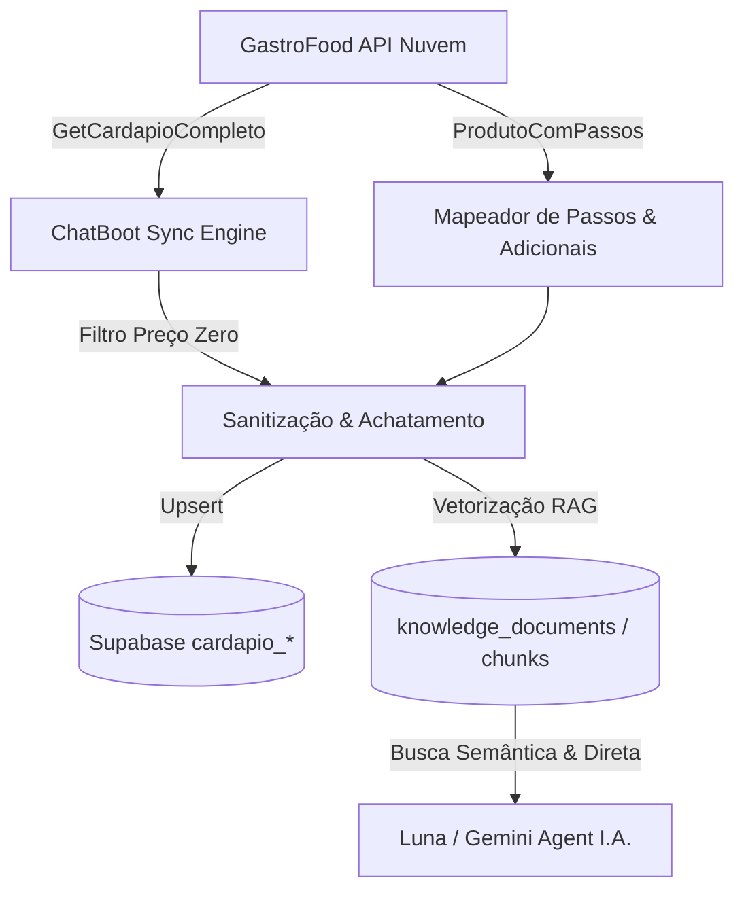

# 📖 Documentação Técnica da API GastroFood & Mapeamento de Cardápio

Esta documentação detalha a estrutura de comunicação, endpoints, hierarquia de produtos, regras de negócio e boas práticas de integração entre a plataforma **ChatBoot SaaS** e o sistema de ERP / Cardápio Digital **GastroFood**.

---

## 1. Visão Geral da Arquitetura

O sistema integra com a API do GastroFood para sincronizar grupos, categorias, produtos e adicionais/opções, permitindo que o motor de Inteligência Artificial (Google Gemini + RAG) responda perguntas sobre o cardápio, informe preços, adicione itens ao pedido e conduza o cliente até o fechamento.



---

## 2. Endpoints Oficiais

### A. Consulta do Cardápio Completo (Produtos de 1º Nível & Grupos)
* **Método**: `POST`
* **URL Padrão**: `https://api.gastrofood.com.br/v6/server/nuvem/ProdutoPdvService/GetCardapioCompleto`
* **Autenticação**: Header `Authorization: Bearer <SEU_TOKEN_GASTROFOOD>`
* **Content-Type**: `application/json`

#### Payload de Requisição:
```json
{
  "AIdStore": "12345",
  "AGuidEstab": "8b1e427b-2321-4ea7-9d7e-90f7d5cbad21"
}
```

#### Estrutura de Resposta (Sucesso - 200 OK):
```json
{
  "status": 200,
  "data": {
    "grupos": [
      {
        "id": 101,
        "description": "Lanches Artesanais",
        "active": true
      },
      {
        "id": 102,
        "description": "Bebidas & Refrigerantes",
        "active": true
      }
    ],
    "produtos": [
      {
        "id": 501,
        "groupId": 101,
        "name": "Burguer Bacon Plus",
        "description": "Pão brioche, burger 180g, queijo cheddar e bacon crocante.",
        "price": 34.90,
        "image": "https://cdn.gastrofood.com.br/img/501.jpg",
        "active": true
      },
      {
        "id": 502,
        "groupId": 102,
        "name": "Refrigerante 350ml",
        "description": "Lata gelada 350ml",
        "price": 7.00,
        "image": null,
        "active": true
      }
    ]
  }
}
```

---

### B. Consulta de Passos, Sub-Itens e Adicionais (ProdutoComPassos)
Quando um produto possui opções aninhadas (ex: sabores de refrigerante, ponto da carne, molhos extras, adicionais de bacon), consulta-se o endpoint de passos.

* **Método**: `POST`
* **URL Padrão**: `https://api.gastrofood.com.br/v6/server/nuvem/ProdutoCardapioService/ProdutoComPassos`
* **Autenticação**: Header `Authorization: Bearer <SEU_TOKEN_GASTROFOOD>`

#### Payload de Requisição:
```json
{
  "AIdProduto": 502,
  "AIdStore": "12345",
  "AGuidEstab": "8b1e427b-2321-4ea7-9d7e-90f7d5cbad21"
}
```

#### Estrutura de Resposta com Sub-itens:
```json
{
  "status": 200,
  "data": {
    "passos": [
      {
        "IdProdutoPassos": 12,
        "Pergunta": "Escolha o sabor do Refrigerante:",
        "SubTitulo": "Obrigatório escolher 1 opção",
        "QtdMin": 1,
        "QtdMax": 1,
        "Ativo": true,
        "ListaProdutos": [
          {
            "IdProduto": 1001,
            "Descricao": "Coca-Cola Original",
            "Preco": 0.00,
            "Ativo": true
          },
          {
            "IdProduto": 1002,
            "Descricao": "Coca-Cola Zero",
            "Preco": 0.00,
            "Ativo": true
          },
          {
            "IdProduto": 1003,
            "Descricao": "Guaraná Antarctica",
            "Preco": 0.00,
            "Ativo": true
          },
          {
            "IdProduto": 1004,
            "Descricao": "Guaraná Zero",
            "Preco": 0.00,
            "Ativo": true
          }
        ]
      },
      {
        "IdProdutoPassos": 13,
        "Pergunta": "Deseja gelo e limão?",
        "SubTitulo": "Opcional",
        "QtdMin": 0,
        "QtdMax": 2,
        "Ativo": true,
        "ListaProdutos": [
          {
            "IdProduto": 2001,
            "Descricao": "Com Gelo e Limão",
            "Preco": 0.00,
            "Ativo": true
          }
        ]
      }
    ]
  }
}
```

---

## 3. Regras de Negócio & Tratamento de Dados

### 🚫 Regra de Filtragem de Preço Zero (R$ 0,00)
Produtos cadastrados com valor `R$ 0,00` são analisados para evitar que cadastros incompletos ou dados poluídos sejam inseridos no cardápio de vendas.

* **Critério de Exceção Legítima**: Itens com valor R$ 0,00 só são mantidos se seu nome ou descrição contiver termos de cortesia/complementos válidos:
  `['catchup', 'ketchup', 'guardanapo', 'molho', 'maionese', 'mostarda', 'barbecue', 'brinde', 'cortesia', 'adicional', 'sachê', 'sache', 'canudo', 'talher', 'limão', 'limao', 'gelo', 'copo']`
* **Produtos Inválidos Descartados**: Qualquer item com valor zero que não pertença à lista de exceções acima é **descartado** automaticamente do mapeamento.

---

### 🌳 Achatamento de Sub-Itens e Otimização para I.A. (RAG)
Para que o Gemini encontre tanto o produto pai quanto qualquer variação:
1. Ao sincronizar um produto pai (ex: `Refrigerante 350ml - R$ 7,00`), o sistema armazena suas opções aninhadas (`Coca-Cola`, `Coca Zero`, `Guaraná Zero`).
2. O gerador de RAG formata a árvore de forma achatada e indexada:
   ```text
   CATEGORIA: BEBIDAS & REFRIGERANTES
   ------------------------------------------------
   REFRIGERANTE 350ML
   Descrição: Lata gelada 350ml
   Preço: R$ 7,00
   Opções / Sabores:
     - Coca-Cola Original (R$ 7,00)
     - Coca-Cola Zero (R$ 7,00)
     - Guaraná Antarctica (R$ 7,00)
     - Guaraná Zero (R$ 7,00)
   ```
3. Dessa forma, quando o cliente perguntar *"Tem Coca Zero?"* ou *"Qual o valor do Guaraná?"*, a I.A. responde instantaneamente com a disponibilidade e o preço correto do item.

---

## 4. Finalização de Pedidos e Pagamento PIX

* **Finalizar Pedido**: `POST /v6/server/nuvem/PedidoCardapioService/FinalizeOrder`
* **Iniciar Transação PIX**: `POST /v1/pagamentos/PixCardapioService/IniciarTransacao`

Ao enviar o pedido, o sistema injeta os IDs de produtos e opções escolhidos pelo cliente na conversa do WhatsApp.

---

## 5. Diretrizes para o Robô de Atendimento (Luna Menu)

O robô **Luna Menu** (`gemini-1.5-pro` / `gemini-2.5-flash`) atua como especialista em cardápio e gastronomia no WhatsApp. Para garantir 100% de fidelidade nas respostas aos clientes, o robô opera com as seguintes diretrizes:

1. **Reconhecimento de Hierarquia de Sabores**:
   * Quando o cliente solicita um sabor específico (ex: *"Vocês têm Guaraná Zero?"*), a IA localiza a opção vinculada ao produto pai (*Refrigerante 350ml*) e informa: *"Temos sim! Guaraná Zero lata 350ml por R$ 7,00"*.
2. **Prevenção de Alucinação de Preços**:
   * A IA nunca inventa valores ou promoções fora do contexto RAG ativo. Caso não localize o item, sugere amigavelmente os itens similares disponíveis.
3. **Respeito ao Filtro de Preço Zero**:
   * Produtos sem valor comercial não são oferecidos. Apenas cortesias e complementos reais (ketchup, guardanapo, maionese da casa, gelo e limão) são mencionados.
4. **Encaminhamento para Fechamento de Pedido**:
   * Uma vez esclarecidas as dúvidas e o cliente definindo seus itens, a conversa é conduzida fluidamente para o robô **Luna Pedido** para conferência e pagamento via PIX ou cartão.

